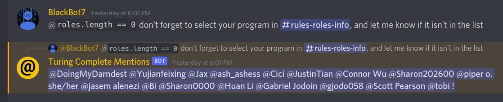
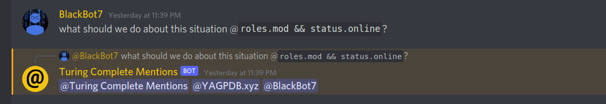

# Turing Complete Mentions

A Discord bot that allows for Turing-Complete mentions

## Overview

This Discord bot allows for mentioning users based on criteria through JavaScript code. Here are some examples:




## Adding This Bot to Your Server

Adding this bot to your server allows you to get the functionality of this assistant withoug having to host it yourself.

### Setup

1. Click on the following link: <https://discord.com/api/oauth2/authorize?client_id=930143352370921532&permissions=8&scope=bot>
2. Select the server you would like to add the bot to
3. Click on _Authorize_

## Hosting This Bot Yourself

Hosting this bot yourself is more involving, but allows you to customize it entirely.

### Requirements

- NodeJS 16.6+

### Setup

1. Create a Discord Bot
   1. Go to the [Discord Developer Portal](https://discord.com/developers/applications)
   2. Click on _New Application_
   3. Create an application called _Turing Complete Mentions_
   4. Go to the _Bot_ tab
   5. Click on _Add a Bot_
   6. Change the bot profile picture
   7. Turn on both `PRESENCE INTENT` and `GUILD_MESSAGE_REACTIONS` permissions
   8. Copy the `Bot Token`, this will be used later
2. Host the bot
   1. Clone this repository
   2. Install the necessary packages: `npm install`
   3. Run the program by passing the Discord Bot Token through command line parameters: `cd src/` `node . DISCORD_BOT_TOKEN`

### Sharing

Below are the steps to get an invite link for your bot.

1. Navitage to the [Discord Developer Portal](https://discord.com/developers/applications)
2. Head to the _OAuth2_ tab
3. Select _bot_ under _OAuth2 URL Generator_
4. Check the _Administrator_ checkbox and copy the generated invite link.

## Usage

### Syntax

To mention users, use the following syntax anywhere within a message:

```JavaScript
@`JAVASCRIPT_CODE`
```

To look for users without mentioning them, use the following syntax anywhere within a message:

```JavaScript
?`JAVASCRIPT_CODE`
```

### Argument Structure

`JAVASCRIPT_CODE` is a string of JavaScript code that will be evaluated once for every user. if `JAVASCRIPT_CODE` returns `true`, the user is included in the mention list. The code is wrapped in the following function internally:

```JavaScript
function(server, member, user, status, activities, roles) {
   return JAVASCRIPT_CODE;
}
```

Below is an example set of arguments that are passed to the function. They are a close mirror of the data from the Discord API.

```JavaScript
server: {
   id: '929037595046969395',
   name: 'ITI1100 A/B',
   icon: '85cdc3e61d24f0b3e1ddded5e05870ac',
   ownerId: '362627068430909450',
   // ...
},
member: {
   joinedTimestamp: 1641595165880,
   premiumSinceTimestamp: null,
   nickname: null,
   pending: false,
   communicationDisabledUntilTimestamp: null,
   // _roles: [ '929039239746846731' ],
},
user: {
   id: '792482454228566016',
   bot: false,
   system: false,
   flags: null,
   username: 'kiSt09JqLD',
   discriminator: '1753',
   avatar: null,
   banner: undefined,
   accentColor: undefined
},
status: {
   online: true,
   idle: false,
   dnd: false,
   offline: false
},
activities: {
   // ...
},
roles: {
'mod': true,
// ...
},
```
